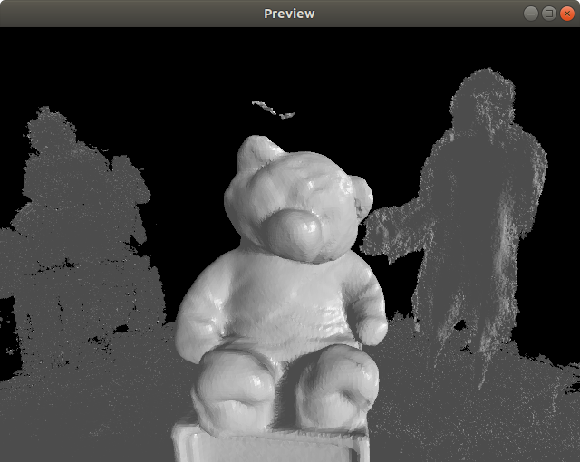

Fuse RGB-D images into voxel maps
===



## Patch Note

+ 2021-07-12: Python bindings now available [here](https://github.com/xingruiy/py_vmapping.git).
+ 2020-05-06: Added Pangolin for visualization

## Installation

+ CMake >= 3.0
+ [OpenCV](https://github.com/opencv/opencv) >= 3.4
+ [Eigen3](https://github.com/eigenteam/eigen-git-mirror) >= 3.3
+ [CUDA](https://developer.nvidia.com/cuda-downloads) >= 10.0 (Although older versions might work)
+ [Pangolin](https://github.com/stevenlovegrove/Pangolin) (Optional, only for visualization)

## Examples

To run the example, make sure you have Pangolin installed. The example should be automatically built during compilation. 

```DatasetLoader``` looks for three files underneath the root path of the dataset:
+ ```calibration.txt``` contains all neccessary intrinsic parameters needed for backprojecting depth. It shoud be a one liner with the format of ```fx fy cx cy```, separated by space.
+ ```associated.txt``` contains the list of color and depth images including their time stamps.
+ ```groundtruth.txt``` have the ground truth poses for all frames. This usually comes with some datasets but you could also provide your own (by running a SLAM system for example).

Run the example with the following format:

```bash
./PangolinDisplay3D <path-to-dataset>/
```
## Acknowledgement

This work is derived from [VoxelHashing](https://github.com/niessner/VoxelHashing) and [InfiniTAM](https://github.com/victorprad/InfiniTAM)
